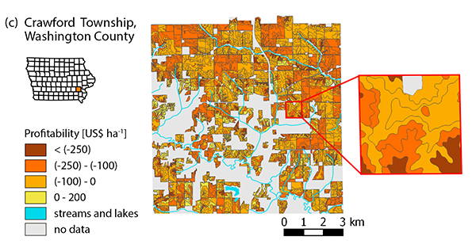
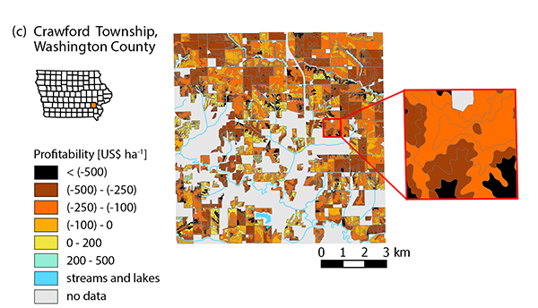

The worst data snafu that stands out in my mind was one that had almost turned into a nightmare, had I noticed it a few days later. Luckly, my manuscript was still under review when I noticed that I had used an incorrect data set for a part of the analysis, so that a map and some calculations needed to be changed. Luckily, the error did not compromize the story the paper was telling, in fact, it made the results look more compelling. But still, it was kind of embarrassing to contact the editor and ask to submit a corrected version. 

The reason for the error was an oddity I have encountered in this coutry and that had cost me a lot of nerves so many times before: I had gotten confused with English and SI units, again!

This issue could have been easily avoided if only my home country (and the rest of the world) would be smart enough to widely adopt US standards of acres and bushels, ... (shush, I should stop here, this promt is about *myself* changing something...)

It would have helped to

* Have a more systematic approach to scripts (SQL queries in this case), e.g., change English units into SI units at the same step in all scripts, and a better way to comment in the script (is there something like R Markdown for postgreSQL?)
* Have a better documentation of the workflow to be able to check if all data processing steps are done, and done correctly.

**Figure based on wrong data:**

**Figure based on corrected data:**

