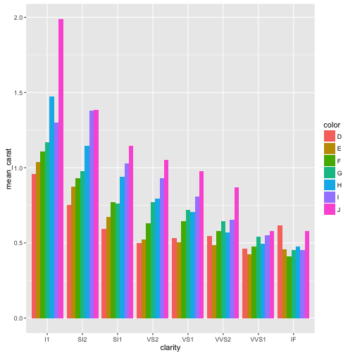

Tidy data must check the three rules: 
- 1) Each variable has its own column; 
- 2) Each observation has its own row;
- and 3) each value has its own cell. 

There are many ways in which we can put the philosophy of tidy data into practice. Base `R` has already many tools and flexibility to help get our data to get in into a tidy format that eases analysis. But **Hadley el al.** see a greater horizon. They see a tidyverse of tidy tools (from an collection of tidy APIs) that work seamlessly to facilitate working with tidy data. For this venture, cross compatibility is crucial. 

An example of this is the implementation of the ‘pipe’ `%>%` operator across packages 


require(dplyr)
require(tidyr)
require(ggplot2)

data("diamonds")

diamonds %>%
  filter(cut == "Ideal") %>%
  group_by(color, clarity) %>%
  summarise(mean_carat=mean(carat)) %>%
  ggplot(aes(x=clarity, y=mean_carat,fill=color)) + 
  geom_bar(stat="identity", position = "dodge")


For this to work, all the functions need to have the `data`  argument as the first to be passed (Essentially the pipe operator puts the data object you have before into the first argument of the following function).

## New frontiers of the ~~Hadley~~Tidyverse

Hadley Wickham in his recent ["talk at useR!2016"](https://channel9.msdn.com/Events/useR-international-R-User-conference/useR2016/Towards-a-grammar-of-interactive-graphics) gave a glimpse of the direction of where data analysis in R is going. The idea seems to make the learning curve less pronounce and to allow more lay users (i.e. non-stats people) to utilize R for the data analysis needs without having to learn all the small details and quirks of R (yes `$` and `[[ ]]`, I am talking about you).

Obviously, this brings about some tension with more experienced R users (the old guard) that argue that not having the insight of how R really works will limit the user to ability to exploit the full potential of the R language. 

### SOMETIME DURING THE QUESTIONS:
> AUDIENCE MEMBER: But Hadley, we can use the dollar sign and square brackets instead…

And this view might be correct, but in my opinion, R should be accessible to everyone, and what you can get out of it should depend level of engagement and work you put into it. I see a day where the principles of tidy data and tidy tools are the norm rather than the exception, and when most my cognitive energy is spent on thinking about the problem that my analysis is trying to solve and not whether I put the correct number of `[[ ]]` in my code.   

<iframe src="//giphy.com/embed/3oz8xuwJ6Kc8UylBRu" width="240" height="135" frameBorder="0" class="giphy-embed" allowFullScreen></iframe>
<a href="http://giphy.com/gifs/southparkgifs-3oz8xuwJ6Kc8UylBRu">via GIPHY</a>

