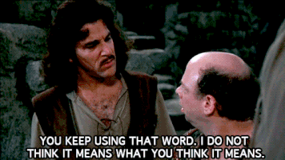

  
---
What is ***grammar*** in computing?

From the dictionary on my Mac:  
"A set of rules governing what strings are valid or allowable in a language or text"

## Purpose?
The grammar of graphics is a set of rules that facilitates statistical graphic generation that seeks 
to achieve multiple goals: 

1. Generate a powerful yet flexible system for statistical graphic generation.
2. Promote an understanding of the steps that everyone uses when generating charts and graphs.
3. Generate intelligent systems with a movement toward automation (human-less) and mine published 
   statistical graphics to recover and interpret existing data. 
4. Help move towards a universal understanding of graphics, both by statisticians and lay people.
5. “bring together in a coherent way things that previously appeared unrelated and which also will 
   provide a basis for dealing systematically with new situations” (Cox 1978).

## Challenges

* Perhaps one of the biggest challenges to a grammar of graphics is the form that the data takes, is
it tidy? Data in a tidy form makes the application of the grammar of graphic much easier. 

The challenge and benefits of the grammar of graphics were demonstrated in class today with the BP oil
rig data. After generating a map with this code:


ggplot() +
    geom_path(data = states, aes(x = long, y = lat, group = group)) + 
    geom_point(data = floats, aes(x = Longitude, y = Latitude, colour = callSign)) +   
    geom_point(aes(x, y), shape = "x", size = 5, data = rig) + 
    geom_text(aes(x, y), label = "BP Oil Rig", size = 5, data = rig, hjust = -0.1) + 
    xlim(c(-91, -80)) + 
    ylim(c(22, 32)) + coord_map()


Notice that we are mapping the position of the variable: floats using the lat and long coordinates.
It is a simple thing to replace that map with a map of animals impacted by the oil spill. To do this
we simply replace data = floats with data = animals. This simple substitution allows us to generate 
the same map of the Gulf, but instead of the floats we are mapping the animals using their coordinates
at the time they were observed (note: color = callSign would not work here, callSign is in the floats
data frame). To me, this is what the grammar of graphics is all about. 

