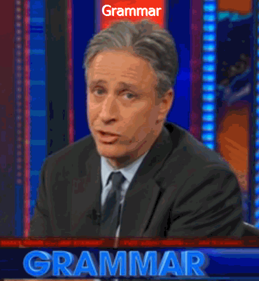
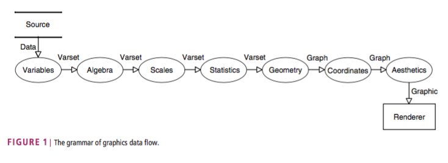
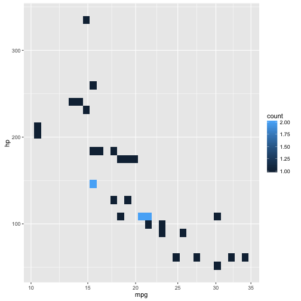
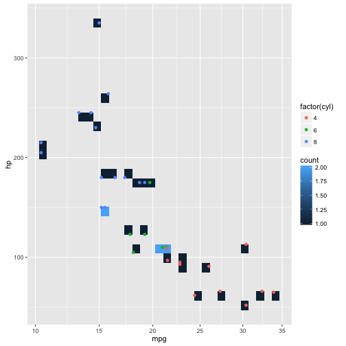
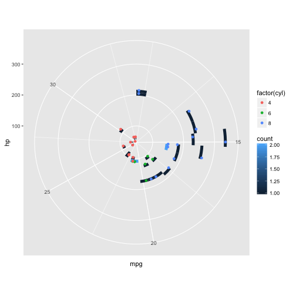
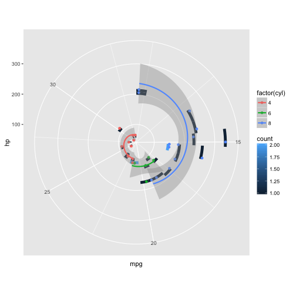

### Not exactly what I mean, but thanks anyway John!

**Grammar of grahics*** (GoG) is the theory behing Hardly Wickam's [ggplot2](http://ggplot2.org/) package. [In his 2010 paper](http://link.springer.com/chapter/10.1007/978-3-642-21551-3_13), Leland Wilkinson describes GoG as a system to produce a statistical graphics. The system contains seven GoG classes embedded in a data flow, which represent the sequence of mappings needed to a graphic from a set or multiple sets of data. The figure below (taken form Wilkinson's paper) shows the data flow of the classes. 

### Here is an example of how GoG is implemented in ggplot2


require(ggplot2)
data("mtcars")


1. Variables maps data to an object called a varset (a set of variables). In ggplot2, for example, you can specify the varset that we want to use by using the data arguement


(p <- ggplot(data=mtcars))


2 and 3. Algebra and Scales are transformations on varsets. For instance, below we trasnform the scale of the x axis using `scale_x_sqrt()`


(p <- p + scale_x_sqrt())


4. Statistics takes a varset and creates a statistical graph. Below the `stat_bin2d()` function performs a summary of counting points within a 2d-bin statistic. 


(p <- p + stat_bin2d(aes(x=mpg, y=hp)))


5. Geometry maps a statistical graph to a geometric graph. Geometry is the "physiscal" graphic we want to see. For example below we add a point geometry to represent individual observations.  


(p <- p + geom_point(aes(x=mpg, y=hp,colour=factor(cyl))))


6. Coordinates embeds a graph in a coordinate space. By default, ggplot2 uses cartesian coordinate system. But we can change it to polar coodinates, for example. 


(p <- p + coord_polar())


5. Aesthetics maps a graph to a visible or perceivable display called a graphic. Note that in a few instances, we have used the `aes()` function to tell ggplot what VARSET we want it to use to map the graph. In this example, we add a regresion line to a set of groups. 


(p <- p + geom_smooth(aes(x=mpg, y=hp,colour=factor(cyl)), method = "lm"))


### What are some challenges with GoG/ggplot2?

- Becasue of its workflow (you have to run through GoG workflow every time) ggplot2 tends to be slower than other base graphic system.

- It may sometimes be difficult to determine whether what you want to see in the graphic is an aesthetic, or a fixed values  (takes a couple of tries to wrap your head around it).

- Although tidy data works beautifully with ggplot2 (and the GoG paradigm), that means that you may need to invest sometime/code tiding your data. It is be harder to pass on to ggplot2 an `aes()` if data is not tidy. You may end up having multiple geom layers. 
