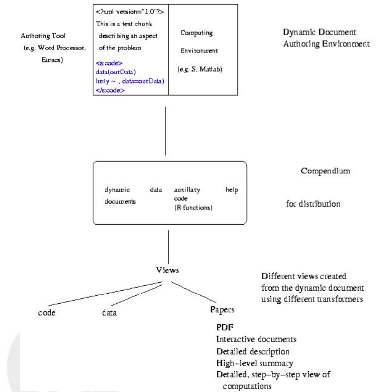

The [crisis of reproducibility](http://www.nature.com/news/1-500-scientists-lift-the-lid-on-reproducibility-1.19970) is a hot topic nowadays. With the advent of easily-accessible computing power to many scholars, and evermore intricate computations to yield results, it has become difficult to reproduce experiments and analyses using the natural language from the methods form a research article. But data scientists have been foreseeing this for a while, and luckily we have tools and concepts to our disposal to tackle this issue as individuals and as scientific community. *Dynamic documents* are one of these.   

## *Compendia*

In their 2004 paper ["Statistical Analyses and Reproducible Research"](http://biostats.bepress.com/bioconductor/paper2/), Robert Gentleman and Duncan Temple Lang introduce the concept of a *compendium*. In their vision, *compendium* would be both, a container for the different elements that make up the dynamic document(s) and its computations (i.e. text, code, data, ...), and as a means for distributing, managing and updating the collection.

The novelty about this concept of a compendium is that the dynamic document(s) contained can also be transformed and used in other ways. So the elements of a dynamic document (i.e. text, code, data) can be extracted and used by others in other ways than the author’s original work. 
The figure below (taken form Gentleman and Temple's paper) presents shows different elements and the flow from the creation of the dynamic documents to the creation of different views.

The main elements of a *compemdium* would be:

1. Dynamic Document(s): An ordered composition of code chunks and text chunks that describe and discuss a problem and its solution. Code chunks are to be written and evaluated in a specific programming language (e.g. `R`, `Python`, `Perl`). Text chunks are intended to be human-readable.

2. Auxiliary software: is support utilities that simplify the computations in the code chunks in the particular dynamic document (or family of related documents). 

3. Transformer: takes as input (e.g. a dynamic document) a compendium and produces the appropriate output (e.g. a pdf, interactive graphic, etc.). It is responsible for identifying the appropriate languages and evaluating code chunks, for ensuring access to any auxiliary software, and for assembling the outputs into the desired result. 

## Think `Sweave` or `knitr`.

Today, there are few options to create Dynamic documents. The package `knitr`, which comes with Rstudio, is currently the most popular dynamic document software for the `R` environment. However, it seems that the concept of *compendium* is not fully implemented in this package, because the 'shareable' content from `knitr` is typically the output (i.e. html, docx, pdf) and not the elements.

To make it more of a *compendium*, it would be needed to share the whole folder in a github repository or elsewhere.   

## Where to next for me?

For the last 2 or so years, I've been toying with the use of dynamic documents as a way to share preliminary analyses or graphics with my collaborators. For instance, this [Rmd presentation](https://dl.dropboxusercontent.com/s/6lzshg6oqk5iyco/sNUE_analysis.html?dl=0#(1)) which I am currently working on. However, I would like to move to actually writing whole manuscripts using `knirt`. The challenge would be to bring collaborators on board. 
